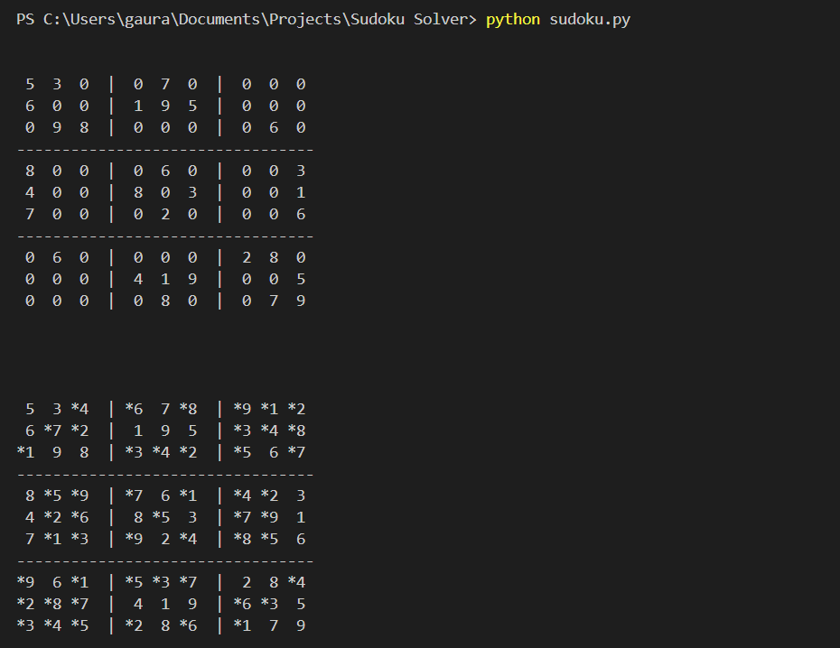

# Sudoku solver with Python

This program solves Sudoku problems by trying values in top to bottom and left to right approach.

## Different Functions
* `def find_empty_fields(board)`\
This functions finds all the empty or `"0"` fields in given Sudoku board and returns their position in format of `(row, col)` tuple.

* `def is_valid(board, number, key)`\
The function takes a key which is the position on Sudoku board we are working on, a number which we are trying to see if is a valid fit for position and finally board itself. Returns `True` if number in position is valid or `False` if not.

* `def insert_number(board, number, key)`\
If number in position is valid (result of `is_valid()`) then this functions will insert the valid number into the position.

* `def solve()`\
This function calls the above functions and iterate over whole board going over each empty field. When in error i.e. `is_valid()` functions cannot return any valid number (1-9) for given field, this functions back-tracks to previous field and finds a new value; this process repeats until whole board only has correct values otherwise back-tracks to more previous fields.

* `def remove_number(board,key)`\
Change a solved field's value to `"0"`. This is helpful when `solve()` is backtracking and want to reset the invalid field so program can go over it again later.

* `def remove_astericks(string)`\
Solved fields start with `*` to easily distinguish them from original fields. This functions removes astericks to work on it in case we back-track.

* `def show_board(board)`\
`show_board()` prints out the board in a readable format in terminal window.